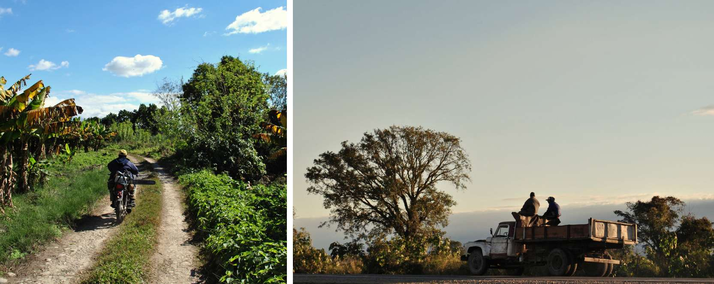

<!-- ---
layout: page
title: Working in an indigenous community in northern Argentina
--- -->
<h1 style="text-align: center;"> Working in an indigenous community in northern Argentina </h1>

In 2014 I had the opportunity to go to the north of Argentina to collaborate as a volunteer in an indigenous community. During my bachelor's years, I was part of a student association for international cooperation, and our university backed us with funds for technical and humanitarian ventures, promoting cultural ties and exchange. Thanks to this support, I traveled to the Bolivia-Argentina border. More specifically, in the Iguopeigenda community near the city of Oran.
 

### Iguopeigenda:

 When I reached the Guarani community of Iguopeigenda, community members had just reclaimed their land. Those lands had been under dispute for years because the company Tabacal Agroindustria had destroyed part of the community's territory to grow sugar cane. As the community lacked essential services like clean water, power, and sanitation, most of the members preferred living in the more comfortable conditions of Oran, which offered schools, electricity, and better security. Yet, many families expressed their desire to return to Iguopeigenda if they could get the basic services. Our small contribution aimed to improve the water treatment situation and lay the foundations for future ruralization of the Iguopeigenda community. We suggested setting up bathrooms with toilets, showers, and a septic tank system. This project was designed in constant collaboration with families in the community, focusing on a simple design that could be easily replicated if successful. 

 Regarding the technical part, we started mapping out the position of the current wells and their depth. This helped us figure out the perfect spots for the latrines to avoid any groundwater contamination. Afterwards, we made a detailed budget of the materials and tools necessary for its execution, taking into account the prices of the products in the city of Oran. Then, through an assembly decision, we decided which families would benefit from this initiative. Finally we executed three water treatment systems: choosing the ideal location, digging the trenches, shaping the terrain, laying pipes, setting up septic tanks and gravel beds to filter the water from the pits and finally set up the toilets and put up the walls.

 In addition to our main project, we also collaborated in a few other community-driven initiatives. We helped finish up a huge concrete septic tank for the community. We also contributed to expanding their bamboo-made community center. Through these initiatives, I delved deeper into the lives of the indigenous people and soaked in their wisdom about nature and their heritage. Being part of this experience let me see their world firsthand, hearing their stories about the struggles they face against the big corporation that wants to take away their lands.

### Jujuy and Salta:

 After a few months working in the community of Iguopeigenda I had a couple of weeks left before flying back to Europe. Being in northern Argentina was probably a one time thing and I decided to make the most of it. I took several night buses to reduce the accommodation cost and see as many things as possible. I started visiting the remarkable regions of Jujuy and Salta. I went to the towns of Purmamarca and Tilcara where I remained in awe with the colorful mountain ranges. Those treeless rainbow mountains create an enchanting canvas that I will always remember. I did some hikes in those vibrant landscapes and learned a lot about the history of Incas, Aymaras and Quechuas.

 I also visited the salt plains that seemed to stretch infinitely giving me a captivating feeling of emptiness. These regions were filled with a unique kind of beauty but it was time to go south and I took a few buses and trains that after two days of travelling brought me to Buenos Aires.

### Buenos Aires:

 Buenos Aires unfolds as a canvas of culture and colors. I strolled through La Boca neighborhood, where streets are dirty and poverty is all around but they all have a special charm. Just a few blocks away you find the colorful and turistic street of Caminito. Then, San Telmo's cobbled paths echo history's whispers. And at Puerto Madero, next to la Plata river, modern skyscrapers meet the calm of the river's coast. I usually do not like cities but I must admit that Buenos Aires' symphony of contrasts and hidden beauty won me over. 

